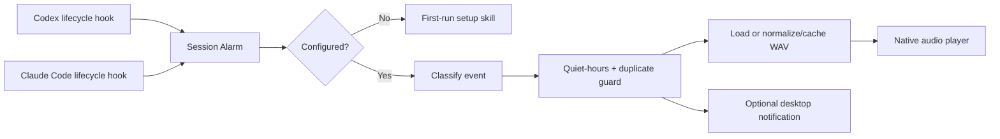

<p align="center">
  
</p>

<h1 align="center">Session Alarm</h1>

<p align="center">
  <strong>Stop babysitting your coding agents.</strong><br>
  Hear a local animal sound when Codex or Claude Code needs you.
</p>

<p align="center">
  <a href="https://github.com/djfksjd/session-alarm/actions/workflows/ci.yml"></a>
  <a href="LICENSE"></a>
  <a href="SOUND_LICENSE.md"></a>
  
  
  
</p>

<p align="center">
  English · <a href="docs/README.ko.md">한국어</a> ·
  <a href="docs/README.ja.md">日本語</a> ·
  <a href="docs/README.zh-CN.md">简体中文</a> ·
  <a href="docs/README.es.md">Español</a>
</p>

---

Session Alarm is a hook-based notification plugin made specifically for **Codex** and
**Claude Code**. It plays a sound and can show a desktop notification when an agent needs input,
finishes a turn, stops with an error, or ends a session.

The 12 built-in choices are short recordings of real animals. Each selected sound was marked
CC0 1.0 Universal on its individual Freesound page when retrieved, and every committed file has
exact source and SHA-256 records in the provenance manifest. You can also import a WAV you created
or are licensed to use.

<table>
  <tr>
    <td width="25%" align="center"><strong>🔔 Deterministic</strong><br>Lifecycle hooks fire without relying on the model to remember.</td>
    <td width="25%" align="center"><strong>🐈 12 + yours</strong><br>Choose a real animal recording or import your own local WAV.</td>
    <td width="25%" align="center"><strong>🛡️ Auditable audio</strong><br>Exact sound pages, licenses, source-preview hashes, and file checksums are documented.</td>
    <td width="25%" align="center"><strong>🏠 Local only</strong><br>No account, server, analytics, telemetry, or network request.</td>
  </tr>
</table>

## What you hear

Choose a different sound for every event during first-run setup.

| Event | Codex signal | Claude Code signal | Default |
|---|---|---|---|
| Needs input | `PermissionRequest` or a question at `Stop` | Permission, elicitation, background-agent input, or a question at `Stop` | Cat |
| Work complete | `Stop` | `Stop` or completed background agent | Rooster |
| Error | Error-aware hook input where available | `StopFailure` | Crow |
| Session ended | `SessionEnd` | `SessionEnd` | Owl |

> [!NOTE]
> “Work complete” means the agent finished its current turn. Session Alarm suppresses completion
> sounds while known background tasks or session schedules remain active.

> [!IMPORTANT]
> Freesound contains uploads under multiple licenses. Only the 12 individual sound pages recorded
> in this repository were checked as CC0; do not treat the entire Freesound catalog as CC0.

## Install

### Codex

```bash
codex plugin marketplace add djfksjd/session-alarm
codex plugin add session-alarm@session-alarm
```

Start a new Codex thread, open `/hooks`, review the bundled commands, and trust the Session Alarm
hooks. On first use, Session Alarm asks you to configure the sounds.

Run the configuration skill explicitly at any time:

```text
$session-alarm
```

### Claude Code

```bash
claude plugin marketplace add djfksjd/session-alarm
claude plugin install session-alarm@session-alarm
```

Start a new session or run `/reload-plugins`, then configure:

```text
/session-alarm:session-alarm
```

### Local development

```bash
git clone https://github.com/djfksjd/session-alarm.git
cd session-alarm
python3 plugins/session-alarm/scripts/session_alarm.py setup
```

Requirements: Python 3.9 or newer, plus a native player. Session Alarm uses `afplay` on macOS,
`paplay`/`aplay`/`ffplay` on Linux, and `winsound` on Windows.

## First-run experience

The setup wizard:

1. displays the full catalog grouped by animal family;
2. lets you preview any sound or add your own WAV before selecting it;
3. maps separate built-in or custom sounds to input, completion, error, and session-end events;
4. sets volume and optional desktop notifications; and
5. optionally enables quiet hours, including schedules that cross midnight.

The same configuration is shared by Codex and Claude Code on the machine.

```bash
# Browse the catalog
python3 plugins/session-alarm/scripts/session_alarm.py catalog

# Preview one sound
python3 plugins/session-alarm/scripts/session_alarm.py preview cat --volume 70

# Hear all 12 in catalog order; press Ctrl+C to stop
python3 plugins/session-alarm/scripts/session_alarm.py preview-all --volume 40

# Or hear just one family
python3 plugins/session-alarm/scripts/session_alarm.py preview-all --group farm --volume 40

# Import your own PCM WAV (up to 30 seconds / 32 MB), then preview it
python3 plugins/session-alarm/scripts/session_alarm.py custom add "./my-chime.wav" \
  --name "My Chime" --id my-chime --preview

# List or remove your imported sounds
python3 plugins/session-alarm/scripts/session_alarm.py custom list
python3 plugins/session-alarm/scripts/session_alarm.py custom remove custom:my-chime --yes

# Configure without the wizard
python3 plugins/session-alarm/scripts/session_alarm.py configure \
  --attention custom:my-chime \
  --complete rooster \
  --error crow \
  --session-end owl \
  --volume 65 \
  --notifications on \
  --quiet-hours 22:00-08:00 \
  --language en

# Test all four events
python3 plugins/session-alarm/scripts/session_alarm.py test all
```

## The 12-sound catalog

| Family | Sounds |
|---|---|
| Pets | Cat, dog |
| Farm | Cow, horse, pig, goat, sheep, rooster |
| Birds | Owl, crow |
| Small creatures | Frog, cricket |

The files are normalized for short notifications. See
[sound provenance and licensing](SOUND_LICENSE.md) and the
[machine-readable asset manifest](plugins/session-alarm/assets/sounds/sources.json).

## How it works



The hook process always returns valid, non-blocking JSON. Malformed payloads, a missing player, or
a notification failure never stop the coding agent.

## Configuration and privacy

Configuration, imported custom WAVs, and generated cache files stay in:

- macOS/Linux: `~/.config/session-alarm/`
- Windows: `%APPDATA%\session-alarm\`
- custom/test environments: `$SESSION_ALARM_HOME`

Session Alarm does not store transcripts. It checks the final assistant message in memory only to
decide whether a stopped turn is asking a question, then discards it. Read the full
[privacy statement](PRIVACY.md) and [security policy](SECURITY.md).

User-imported audio is not uploaded or covered by the bundled asset license. You retain its rights
and are responsible for using audio you created or are licensed to use.

## Development

```bash
python3 -m unittest discover -s tests -v

python3 ~/.codex/skills/.system/plugin-creator/scripts/validate_plugin.py \
  plugins/session-alarm

claude plugin validate --strict plugins/session-alarm
claude plugin validate --strict .
```

The CI workflow runs the test suite on Linux, macOS, and Windows. `main` is protected by an active
GitHub ruleset that requires pull requests and the `test` status check.

Contributions are welcome; read [CONTRIBUTING.md](CONTRIBUTING.md). Audio changes require an
individual source page, contributor, verified license, exact source-preview provenance, and
checksums.

## License

Code and documentation are released under the [MIT License](LICENSE). Bundled recordings are
CC0 assets with file-level provenance documented in [SOUND_LICENSE.md](SOUND_LICENSE.md) and
[third-party notices](THIRD_PARTY_NOTICES.md).

Session Alarm is independent and is not affiliated with OpenAI or Anthropic. See
[TRADEMARKS.md](TRADEMARKS.md).
