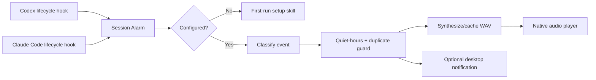

<p align="center">
  
</p>

<h1 align="center">Session Alarm</h1>

<p align="center">
  <strong>Stop babysitting your coding agents.</strong><br>
  Hear a local animal sound when Codex or Claude Code needs you.
</p>

<p align="center">
  <a href="https://github.com/djfksjd/session-alarm/actions/workflows/ci.yml"></a>
  <a href="LICENSE"></a>
  
  
  
</p>

<p align="center">
  English · <a href="docs/README.ko.md">한국어</a> ·
  <a href="docs/README.ja.md">日本語</a> ·
  <a href="docs/README.zh-CN.md">简体中文</a> ·
  <a href="docs/README.es.md">Español</a>
</p>

---

Session Alarm is a hook-based notification plugin made specifically for **Codex** and
**Claude Code**. It plays a sound and can show a desktop notification when an agent needs input,
finishes a turn, stops with an error, or ends a session.

All 40 choices are generated from original 44.1 kHz acoustic-modeling recipes. No recordings,
stock effects, model-generated clips, celebrity voices, or third-party samples are included.

<table>
  <tr>
    <td width="25%" align="center"><strong>🔔 Deterministic</strong><br>Lifecycle hooks fire without relying on the model to remember.</td>
    <td width="25%" align="center"><strong>🐊 40 animals</strong><br>From cats and ducks to crocodiles, elephants, hyenas, and whales.</td>
    <td width="25%" align="center"><strong>🛡️ Original audio</strong><br>No memes, celebrity voices, broadcasts, stock effects, or third-party samples.</td>
    <td width="25%" align="center"><strong>🏠 Local only</strong><br>No account, server, analytics, telemetry, or network request.</td>
  </tr>
</table>

## What you hear

Choose a different sound for every event during first-run setup.

| Event | Codex signal | Claude Code signal | Default |
|---|---|---|---|
| Needs input | `PermissionRequest` or a question at `Stop` | Permission, elicitation, background-agent input, or a question at `Stop` | Duck |
| Work complete | `Stop` | `Stop` or completed background agent | Rooster |
| Error | Error-aware hook input where available | `StopFailure` | Frog |
| Session ended | `SessionEnd` | `SessionEnd` | Owl |

> [!NOTE]
> “Work complete” means the agent finished its current turn. Session Alarm suppresses completion
> sounds while known background tasks or session schedules remain active.

## Install

### Codex

```bash
codex plugin marketplace add djfksjd/session-alarm
codex plugin add session-alarm@session-alarm
```

Start a new Codex thread, open `/hooks`, review the bundled commands, and trust the Session Alarm
hooks. On first use, Session Alarm asks you to configure the sounds.

Run the configuration skill explicitly at any time:

```text
$session-alarm
```

### Claude Code

```bash
claude plugin marketplace add djfksjd/session-alarm
claude plugin install session-alarm@session-alarm
```

Start a new session or run `/reload-plugins`, then configure:

```text
/session-alarm:session-alarm
```

### Local development

```bash
git clone https://github.com/djfksjd/session-alarm.git
cd session-alarm
python3 plugins/session-alarm/scripts/session_alarm.py setup
```

Requirements: Python 3.9 or newer, plus a native player. Session Alarm uses `afplay` on macOS,
`paplay`/`aplay`/`ffplay` on Linux, and `winsound` on Windows.

## First-run experience

The setup wizard:

1. displays the full catalog grouped by animal family;
2. lets you preview any sound before selecting it;
3. maps separate sounds to input, completion, error, and session-end events;
4. sets volume and optional desktop notifications; and
5. optionally enables quiet hours, including schedules that cross midnight.

The same configuration is shared by Codex and Claude Code on the machine.

```bash
# Browse the catalog
python3 plugins/session-alarm/scripts/session_alarm.py catalog

# Preview one sound
python3 plugins/session-alarm/scripts/session_alarm.py preview crocodile --volume 70

# Hear all 40 in catalog order; press Ctrl+C to stop
python3 plugins/session-alarm/scripts/session_alarm.py preview-all --volume 40

# Or hear just one family
python3 plugins/session-alarm/scripts/session_alarm.py preview-all --group wild --volume 40

# Configure without the wizard
python3 plugins/session-alarm/scripts/session_alarm.py configure \
  --attention crocodile \
  --complete elephant \
  --error hyena \
  --session-end owl \
  --volume 65 \
  --notifications on \
  --quiet-hours 22:00-08:00 \
  --language en

# Test all four events
python3 plugins/session-alarm/scripts/session_alarm.py test all
```

## The 40-sound catalog

| Family | Sounds |
|---|---|
| Pets | Cat, kitten, dog, puppy |
| Farm | Cow, horse, donkey, pig, goat, sheep, duck, goose, chicken, rooster, turkey |
| Wild | Wolf, fox, lion, elephant, monkey, bear, crocodile, hyena, camel, raccoon, hippo, snake |
| Birds | Owl, crow, sparrow, eagle, peacock, penguin |
| Small creatures | Frog, cricket, bee, mosquito |
| Ocean | Dolphin, seal, whale |

Each label describes an original sound design inspired by that animal, not a field recording.
See [sound provenance and licensing](SOUND_LICENSE.md).

## How it works



The hook process always returns valid, non-blocking JSON. Malformed payloads, a missing player, or
a notification failure never stop the coding agent.

## Configuration and privacy

Configuration and generated WAV cache files stay in:

- macOS/Linux: `~/.config/session-alarm/`
- Windows: `%APPDATA%\session-alarm\`
- custom/test environments: `$SESSION_ALARM_HOME`

Session Alarm does not store transcripts. It checks the final assistant message in memory only to
decide whether a stopped turn is asking a question, then discards it. Read the full
[privacy statement](PRIVACY.md) and [security policy](SECURITY.md).

## Development

```bash
python3 -m unittest discover -s tests -v

python3 ~/.codex/skills/.system/plugin-creator/scripts/validate_plugin.py \
  plugins/session-alarm

claude plugin validate --strict plugins/session-alarm
claude plugin validate --strict .
```

The CI workflow runs the test suite on Linux, macOS, and Windows. `main` is protected by an active
GitHub ruleset that requires pull requests and the `test` status check.

Contributions are welcome; read [CONTRIBUTING.md](CONTRIBUTING.md). New sound contributions must
use original synthesis recipes and cannot contain sampled audio.

## License

Code is released under the [MIT License](LICENSE). WAV files generated solely from the original
recipes are dedicated under CC0 1.0 as described in [SOUND_LICENSE.md](SOUND_LICENSE.md).

Session Alarm is independent and is not affiliated with OpenAI or Anthropic. See
[TRADEMARKS.md](TRADEMARKS.md).
