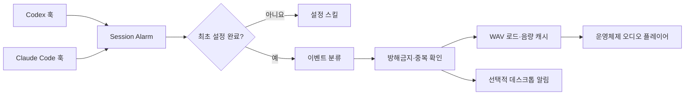

<p align="center">
  
</p>

<h1 align="center">Session Alarm</h1>

<p align="center">
  <strong>코딩 에이전트 화면을 계속 지켜보지 마세요.</strong><br>
  Codex나 Claude Code에 내가 필요할 때 동물 소리로 알려줍니다.
</p>

<p align="center">
  <a href="https://github.com/djfksjd/session-alarm/actions/workflows/ci.yml"></a>
  <a href="../LICENSE"></a>
  <a href="../SOUND_LICENSE.md"></a>
  
  
</p>

<p align="center">
  <a href="../README.md">English</a> · 한국어 ·
  <a href="README.ja.md">日本語</a> ·
  <a href="README.zh-CN.md">简体中文</a> ·
  <a href="README.es.md">Español</a>
</p>

---

Session Alarm은 **Codex와 Claude Code 전용 훅 기반 알림 플러그인**입니다. 에이전트가
사용자 입력을 기다리거나, 현재 작업을 마치거나, 오류로 중단되거나, 세션을 종료할 때
소리와 선택적 데스크톱 알림을 보냅니다.

내장 40종은 자체 생성한 동물 테마 알림음 39종과 개별 출처를 검증한 Pixabay 코끼리
음원 1종입니다. 모든 파일의 생성 시드 또는 정확한 출처·라이선스·SHA-256을 매니페스트에
기록합니다. 직접 만들었거나 사용 허가를 받은 WAV도 추가할 수 있으며 사용자 파일은
컴퓨터 밖으로 전송되지 않습니다.

<table>
  <tr>
    <td width="25%" align="center"><strong>🔔 확실한 작동</strong><br>모델의 기억이 아니라 라이프사이클 훅으로 실행됩니다.</td>
    <td width="25%" align="center"><strong>🐊 40종 + 내 소리</strong><br>동물 소리를 고르거나 내 WAV를 추가합니다.</td>
    <td width="25%" align="center"><strong>🛡️ 라이선스 확인</strong><br>상업적 이용 조건·출처·확인일·파일 해시를 공개합니다.</td>
    <td width="25%" align="center"><strong>🏠 완전한 로컬</strong><br>계정·서버·분석·텔레메트리·네트워크 요청이 없습니다.</td>
  </tr>
</table>

## 어떤 상황에 울리나요?

최초 설정에서 네 가지 이벤트에 서로 다른 소리를 지정합니다.

| 이벤트 | Codex | Claude Code | 기본값 |
|---|---|---|---|
| 사용자 입력 필요 | 권한 요청 또는 질문으로 끝난 응답 | 권한·선택 창·백그라운드 에이전트 입력 또는 질문 | 오리 |
| 작업 완료 | 현재 응답 종료 | 현재 응답 또는 백그라운드 에이전트 완료 | 수탉 |
| 오류 | 감지 가능한 오류 이벤트 | `StopFailure` | 개구리 |
| 세션 종료 | `SessionEnd` | `SessionEnd` | 올빼미 |

> [!NOTE]
> 여기서 “작업 완료”는 에이전트가 현재 턴을 끝냈다는 뜻입니다. 백그라운드 작업이나
> 세션 예약이 진행 중이라고 확인되면 완료 알림을 울리지 않습니다.

> [!IMPORTANT]
> 자체 생성 알림음 39종은 MIT가 적용됩니다. 코끼리 음원 1종은 Pixabay Content
> License가 적용되며 별도 효과음처럼 추출·재배포하면 안 됩니다.

## 설치

### Codex

```bash
codex plugin marketplace add djfksjd/session-alarm
codex plugin add session-alarm@session-alarm
```

새 Codex 스레드를 시작한 뒤 `/hooks`에서 Session Alarm 명령을 검토하고 신뢰 처리하세요.
최초 사용 시 사운드 설정을 안내합니다. 언제든 아래 스킬을 직접 실행할 수 있습니다.

```text
$session-alarm
```

### Claude Code

```bash
claude plugin marketplace add djfksjd/session-alarm
claude plugin install session-alarm@session-alarm
```

새 세션을 시작하거나 `/reload-plugins`를 실행한 뒤 설정하세요.

```text
/session-alarm:session-alarm
```

### 로컬 실행

```bash
git clone https://github.com/djfksjd/session-alarm.git
cd session-alarm
python3 plugins/session-alarm/scripts/session_alarm.py setup
```

Python 3.9 이상이 필요합니다. macOS는 `afplay`, Linux는 `paplay`·`aplay`·`ffplay`,
Windows는 `winsound`를 사용합니다.

## 최초 설정

설정 마법사에서 다음을 할 수 있습니다.

1. 동물 분류별로 정리된 전체 카탈로그 확인
2. 선택하기 전 원하는 사운드를 듣거나 내 WAV 추가
3. 입력 필요·완료·오류·세션 종료에 내장 또는 사용자 소리 지정
4. 음량과 데스크톱 알림 설정
5. 자정을 넘는 시간도 지원하는 방해금지 시간 설정

Codex와 Claude Code는 같은 로컬 설정을 공유합니다.

```bash
# 전체 사운드 보기
python3 plugins/session-alarm/scripts/session_alarm.py catalog --language ko

# 악어 소리 미리 듣기
python3 plugins/session-alarm/scripts/session_alarm.py preview crocodile --volume 70

# 40종 전체를 순서대로 듣기 (중단: Ctrl+C)
python3 plugins/session-alarm/scripts/session_alarm.py preview-all --volume 40 --language ko

# 야생동물만 듣기
python3 plugins/session-alarm/scripts/session_alarm.py preview-all --group wild --volume 40 --language ko

# 직접 만든 WAV 추가 후 즉시 미리 듣기 (최대 30초 / 32MB)
python3 plugins/session-alarm/scripts/session_alarm.py custom add "./내 효과음.wav" \
  --name "내 효과음" --id my-sound --preview

# 추가한 소리 확인 또는 삭제
python3 plugins/session-alarm/scripts/session_alarm.py custom list
python3 plugins/session-alarm/scripts/session_alarm.py custom remove custom:my-sound --yes

# 마법사 없이 설정
python3 plugins/session-alarm/scripts/session_alarm.py configure \
  --attention custom:my-sound \
  --complete elephant \
  --error hyena \
  --session-end owl \
  --volume 65 \
  --notifications on \
  --quiet-hours 22:00-08:00 \
  --language ko

# 네 가지 이벤트 테스트
python3 plugins/session-alarm/scripts/session_alarm.py test all
```

## 동물 사운드 40종

| 분류 | 사운드 |
|---|---|
| 반려동물 | 고양이, 아기 고양이, 강아지, 아기 강아지 |
| 농장동물 | 소, 말, 당나귀, 돼지, 염소, 양, 오리, 거위, 암탉, 수탉, 칠면조 |
| 야생동물 | 늑대, 여우, 사자, 코끼리, 원숭이, 곰, 악어, 하이에나, 낙타, 라쿤, 하마, 뱀 |
| 새 | 올빼미, 까마귀, 참새, 독수리, 공작, 펭귄 |
| 작은 생물 | 개구리, 귀뚜라미, 벌, 모기 |
| 바다동물 | 돌고래, 물개, 고래 |

알림에 맞게 짧고 균일하게 정규화했습니다. [음원 출처 및 라이선스](../SOUND_LICENSE.md)와
[파일별 매니페스트](../plugins/session-alarm/assets/sounds/sources.json)를 확인하세요.

## 작동 구조



훅은 항상 유효한 비차단 JSON을 반환합니다. 잘못된 입력, 플레이어 부재, 알림 실패가
Codex나 Claude Code의 작업을 막지 않습니다.

## 개인정보와 라이선스

설정, 추가한 사용자 WAV, 생성된 캐시는 macOS/Linux의 `~/.config/session-alarm/`
또는 Windows의 `%APPDATA%\session-alarm\`에만 저장됩니다. 대화나 파일 내용을
저장·전송하지 않으며 네트워크 요청도 하지 않습니다. 사용자가 추가한 음원의 권리는
사용자에게 있으며, 직접 만들었거나 사용 허가를 받은 파일만 사용해야 합니다. 자세한
내용은 [개인정보 안내](../PRIVACY.md)와 [보안 정책](../SECURITY.md)을 확인하세요.

코드·문서·자체 생성 WAV 39종은 [MIT 라이선스](../LICENSE)입니다. 코끼리 WAV에는
[Pixabay Content License](../SOUND_LICENSE.md)가 적용됩니다.
이 프로젝트는 OpenAI 또는 Anthropic과 제휴하거나 후원받지 않은 독립 오픈소스
프로젝트입니다.
