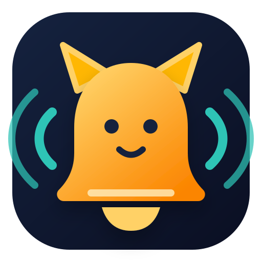

<p align="center">
  
</p>

<h1 align="center">Session Alarm</h1>

<p align="center">
  <strong>不必一直盯着你的编程智能体。</strong><br>
  当 Codex 或 Claude Code 需要你时，用动物声音提醒你。
</p>

<p align="center">
  <a href="https://github.com/djfksjd/session-alarm/actions/workflows/ci.yml"></a>
  <a href="../LICENSE"></a>
  
  
</p>

<p align="center">
  <a href="../README.md">English</a> ·
  <a href="README.ko.md">한국어</a> ·
  <a href="README.ja.md">日本語</a> · 简体中文 ·
  <a href="README.es.md">Español</a>
</p>

---

Session Alarm 是专为 **Codex 和 Claude Code** 设计的生命周期钩子通知插件。当智能体
需要输入、完成当前轮次、因错误停止或结束会话时，它会播放声音，并可显示桌面通知。

全部 40 种声音均由原创 44.1 kHz 声学建模配方生成，不包含录音、素材音效、
AI 生成片段、名人声音或第三方样本。
也可以添加自己制作或已获授权的 WAV；文件始终保存在本机。

<table>
  <tr>
    <td width="25%" align="center"><strong>🔔 确定性触发</strong><br>由生命周期钩子运行，不依赖模型记忆。</td>
    <td width="25%" align="center"><strong>🐊 40 种动物</strong><br>从猫和鸭子到鳄鱼、大象、鬣狗和鲸鱼。</td>
    <td width="25%" align="center"><strong>🛡️ 原创音频</strong><br>不使用迷因、名人、广播、素材音效或第三方样本。</td>
    <td width="25%" align="center"><strong>🏠 完全本地</strong><br>无账户、服务器、分析、遥测或网络请求。</td>
  </tr>
</table>

## 何时提醒

| 事件 | Codex | Claude Code | 默认声音 |
|---|---|---|---|
| 需要输入 | 权限请求或以问题结束的响应 | 权限、选择对话框、后台智能体输入请求或问题 | 鸭子 |
| 工作完成 | 当前响应停止 | 当前响应停止或后台智能体完成 | 公鸡 |
| 错误 | 可用的错误事件 | `StopFailure` | 青蛙 |
| 会话结束 | `SessionEnd` | `SessionEnd` | 猫头鹰 |

> [!NOTE]
> “工作完成”表示智能体完成了当前轮次。检测到后台任务或会话计划仍在运行时，
> Session Alarm 会抑制完成提示音。

## 安装

### Codex

```bash
codex plugin marketplace add djfksjd/session-alarm
codex plugin add session-alarm@session-alarm
```

打开新的 Codex 线程，在 `/hooks` 中检查并信任 Session Alarm 的命令。随时可运行：

```text
$session-alarm
```

### Claude Code

```bash
claude plugin marketplace add djfksjd/session-alarm
claude plugin install session-alarm@session-alarm
```

启动新会话或运行 `/reload-plugins`，然后配置：

```text
/session-alarm:session-alarm
```

### 本地运行

```bash
git clone https://github.com/djfksjd/session-alarm.git
cd session-alarm
python3 plugins/session-alarm/scripts/session_alarm.py setup
```

需要 Python 3.9 或更高版本。macOS 使用 `afplay`，Linux 使用
`paplay`、`aplay` 或 `ffplay`，Windows 使用 `winsound`。

## 首次配置

首次设置向导可以浏览并试听完整目录、添加自己的 WAV，分别选择“需要输入、完成、错误、会话结束”的声音，
设置音量、桌面通知和可跨越午夜的免打扰时段。Codex 与 Claude Code 共享同一份本地配置。

```bash
# 查看目录
python3 plugins/session-alarm/scripts/session_alarm.py catalog

# 试听鳄鱼
python3 plugins/session-alarm/scripts/session_alarm.py preview crocodile --volume 70

# 按顺序试听全部 40 种声音（停止：Ctrl+C）
python3 plugins/session-alarm/scripts/session_alarm.py preview-all --volume 40

# 添加并试听自己的 WAV（最长 30 秒 / 32 MB）
python3 plugins/session-alarm/scripts/session_alarm.py custom add "./my-sound.wav" \
  --name "My Sound" --id my-sound --preview

# 测试全部四个事件
python3 plugins/session-alarm/scripts/session_alarm.py test all
```

## 40 种动物声音

| 类别 | 动物 |
|---|---|
| 宠物 | 猫、幼猫、狗、幼犬 |
| 农场 | 牛、马、驴、猪、山羊、绵羊、鸭、鹅、母鸡、公鸡、火鸡 |
| 野生 | 狼、狐狸、狮子、大象、猴子、熊、鳄鱼、鬣狗、骆驼、浣熊、河马、蛇 |
| 鸟类 | 猫头鹰、乌鸦、麻雀、鹰、孔雀、企鹅 |
| 小型生物 | 青蛙、蟋蟀、蜜蜂、蚊子 |
| 海洋 | 海豚、海豹、鲸鱼 |

每个名称表示受相应动物启发的原创声音设计，并非实地录音。请参阅
[声音来源与许可](../SOUND_LICENSE.md)。

## 隐私与许可

配置、导入的 WAV 和生成缓存只保存在 macOS/Linux 的 `~/.config/session-alarm/` 或 Windows 的
`%APPDATA%\session-alarm\`。本项目不保存或传输对话和文件内容，也不发起网络请求。
详见[隐私说明](../PRIVACY.md)和[安全策略](../SECURITY.md)。

导入音频的权利不会改变；请仅使用自己制作或已获授权的音频。

代码采用 [MIT 许可证](../LICENSE)，仅由原创配方生成的 WAV 依据
[CC0 1.0](../SOUND_LICENSE.md) 提供。
本项目是独立开源项目，与 OpenAI 或 Anthropic 没有关联、认可或赞助关系。
